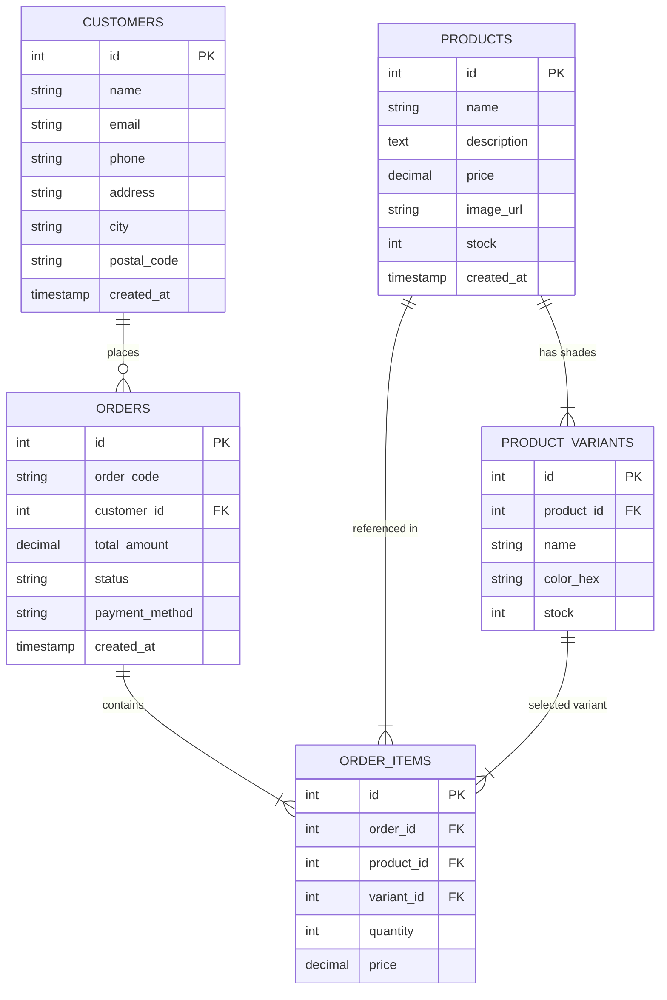

# ACADEMIC PROJECT REPORT: LUMÉA BEAUTY E-COMMERCE PLATFORM

---

## PROJECT INFORMATION

* **Project Title**: Luméa — Single-Product Beauty E-Commerce Platform
* **Academic Discipline**: Software Engineering / Web Application Development
* **Technology Stack**: React.js, Express.js (Node.js), MySQL Database, CSS3 / Tailwind CSS
* **Author / Developer**: Kichu Sharma
* **Date of Submission**: September 2026

---

## EXECUTIVE SUMMARY / ABSTRACT

The modern web application landscape relies heavily on focused, user-centric e-commerce platforms designed to streamline customer purchasing decisions. **Luméa** is a full-stack, single-product e-commerce web application developed to demonstrate standard end-to-end software design, database normalization, RESTful API construction, and modern responsive user interface design. 

Unlike traditional multi-category online stores, Luméa concentrates on a single flagship cosmetic product—**Luméa Glow Tint**—available in six distinct color variants (shades). The application presents a seamless consumer journey from product discovery and interactive shade selection to bag management and checkout. Additionally, the system provides a secure, administrative dashboard enabling store administrators to execute full CRUD operations, adjust shade inventory levels, track customer lifetime metrics, and manage order fulfillment states (`Pending` $\rightarrow$ `Confirmed` $\rightarrow$ `Processing` $\rightarrow$ `Shipped` $\rightarrow$ `Delivered`).

---

## 1. INTRODUCTION & OBJECTIVES

### 1.1 Problem Statement
Traditional multi-product e-commerce platforms can overwhelm customers with choices, leading to decision fatigue and complicated database overhead for boutique brands. Furthermore, educational web development projects often over-extend scope by attempting to build massive catalog platforms without finishing core relational workflows.

### 1.2 Proposed Solution
Luméa solves this by implementing a **single-product hero store strategy**. It provides:
1. An immersive, aesthetically refined front-end landing page tailored to beauty cosmetics.
2. An interactive visual shade picker using HSL-tailored hex values.
3. A robust MySQL backend ensuring ACID-compliant order transactions.
4. An administrative panel for monitoring sales metrics and managing logistics.

### 1.3 Key Academic & Practical Objectives
- **Responsive Frontend Engineering**: Build a dynamic Single-Page Application (SPA) using React 18, React Hooks, and Context API.
- **Relational Database Design**: Design a 3NF normalized MySQL database with primary/foreign key relationships across 5 entity tables.
- **RESTful API Services**: Construct a Node.js + Express backend providing standardized JSON endpoints.
- **Full Order Lifecycle Management**: Track order state transitions and stock deductions upon customer checkout.

---

## 2. SYSTEM ARCHITECTURE & DESIGN

### 2.1 High-Level Architecture
The system follows a classic 3-Tier Client-Server Architecture:

```
+-------------------------------------------------------+
|                    PRESENTATION TIER                  |
|          React 18 Single Page Application (SPA)       |
|  - Storefront Landing Page    - Shopping Bag Drawer   |
|  - Shade Configurator         - Checkout Workflow     |
|  - Order Status Verification  - Admin Dashboard UI    |
+---------------------------+---------------------------+
                            |
                            | HTTP REST (JSON)
                            v
+-------------------------------------------------------+
|                    APPLICATION TIER                   |
|                   Node.js + Express Server            |
|  - Product Controller         - Order Controller      |
|  - Inventory Validation       - Customer Controller   |
|  - KPI Aggregator             - CORS & Error Handling |
+---------------------------+---------------------------+
                            |
                            | SQL Queries (mysql2)
                            v
+-------------------------------------------------------+
|                    DATA TIER                          |
|                 MySQL Relational DB                   |
|  - products                   - orders                |
|  - product_variants (shades)  - order_items           |
|  - customers                  - system indices        |
+-------------------------------------------------------+
```

---

## 3. DATABASE DESIGN & ENTITY RELATIONSHIPS

### 3.1 Entity Relationship (ER) Diagram



---

## 4. MODULE SPECIFICATIONS

### 4.1 Customer Storefront Module
* **Hero Branding**: Interactive luxury header featuring custom typography (`Playfair Display`), brand tagline (*"Glow, your way."*), and dynamic call-to-action buttons.
* **Shade Picker & Live Preview**: Real-time shade selection updating hex color swatches and available inventory notifications.
* **Bag Context & Cart Drawer**: Global state management using React Context API allowing quantity increments, decrements, subtotal computation, and drawer toggles.
* **Checkout Engine**: Form validation for shipping info and payment choice (Cash on Delivery / UPI Demo), issuing POST requests to backend API.

### 4.2 Administrative Dashboard Module
* **KPI Metrics Panel**: Instant calculation of Total Revenue (₹), Order Volume, Pending Fulfillments, and Top Performing Shade.
* **Order Logistics Table**: Real-time status modification dropdown (`Pending`, `Confirmed`, `Processing`, `Shipped`, `Delivered`, `Cancelled`).
* **Inventory & Shade Manager**: Direct inline controls to restock specific shades or modify product pricing.
* **Customer Roster**: Data table tracking aggregate spending per customer and historical order frequency.

---

## 5. USER INTERFACE & BRAND IDENTITY

* **Primary Palette**: Soft Rose (`#D96C8A`), Cream White (`#FFF8FA`), Deep Charcoal Brown (`#2B2024`), Soft Pink (`#F4D8DF`).
* **Typography**: Playfair Display for headings; Inter for body copy and administrative interface.
* **Micro-Interactions**: Hover scale transformations, smooth drawer transitions, visual checkmark badges on shade selection.

---

## 6. VERIFICATION & TESTING

1. **Database Integrity Testing**: Foreign key constraint validation on `order_items` deletion and customer cascade checks.
2. **API Endpoint Verification**: Validation of JSON payloads for `POST /api/orders` ensuring total amounts match item calculations.
3. **Responsive UI Verification**: Testing across desktop (1440px), tablet (768px), and mobile (375px) viewports.

---

## 7. CONCLUSION & FUTURE ENHANCEMENTS

The **Luméa Beauty E-Commerce Project** successfully fulfills all academic requirements of a modern full-stack web application. Future scope includes integrating live payment gateways (Razorpay/Stripe), customer accounts with order history tracking, and AI-driven shade matching recommendations.
